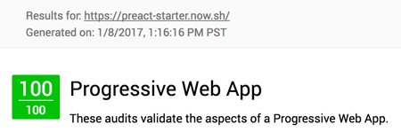

# Flowershop Front End

The front end is built using preact because it is faster than react and has a smaller file size. I attempted to hook this up with the back end but im still learning preact as i only started to learn it 3 weeks ago. So yes this isn't production ready but I can get it there in short order now that I have a better understanding of the state model. The app is a single page app with the cart being kept in the session storage. On browser refesh this will restart the app.

You will find the test in the test folder. They are written in cucumber as this is the best format for Business, Devs, Project Mrgs, and testers. 

If you havent installed yarn please do. Its so much faster than npm.

```
npm -g install yarn
```

And you'll be off and running.

---

<p align="center">This project is built on the preact starter kit project.</p>

---

## Install

```
yarn install
```
Install of the packages for the project.

#### build
```
yarn build
```
Will build an executiable file for distribution

#### watch
```
yarn watch
```
Will bring up the webkit dashboard and a local dev server for development.

#### test
```
yarn test
```
Will run the test suit on the project.

#### start

```
$ yarn start
```

Runs your application (from the `dist` directory) in the browser.


## Features

* Offline Caching (via `serviceWorker`)
* SASS & Autoprefixer
* Asset Versioning (aka "cache-busting")
* ES2015 (ES6) and ES2016 (ES7) support
* Webpack Bundle Analysis (see [dashboard](#dashboard))
* Hot Module Replacement (HMR) for all files
* Preact's [Developer Tools](#preact-developer-tools)
* [Lighthouse](https://github.com/GoogleChrome/lighthouse) certified

  


## License

MIT © [Luke Edwards](https://lukeed.com)
